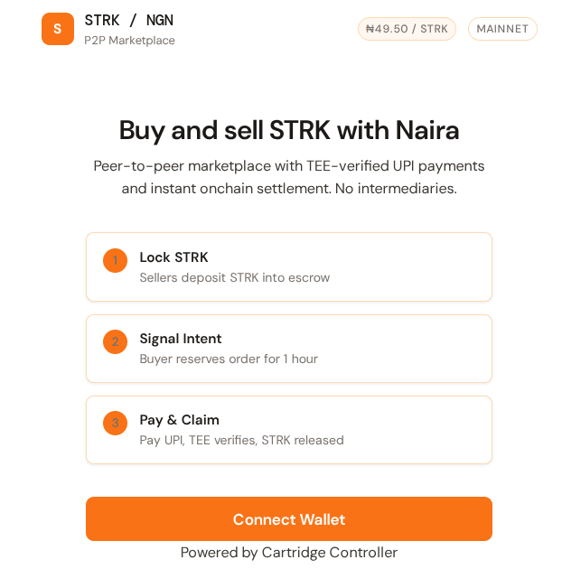

# Zappay




P2P Naira (via bank transfer) <> STRK Marketplace for on/offramp with off-chain payments, verified by an Eigen TEE.

## TL;DR

- **Seller** locks STRK in an on-chain escrow with their payment details.
- **Buyer** sends the Naira payment off-chain.
- A **headless browser inside an Eigen TEE** verifies the payment and signs the receipt.
- The signed proof is submitted **on-chain**, validated against the escrow, and **STRK is released to the buyer**.

---

## Architecture

```
┌─────────────┐     deposit STRK + payment details  ┌──────────────────┐
│   Seller    │ ──────────────────────────────────► │  Starknet        │
│             │                                      │  Escrow Contract │
└─────────────┘                                      └────────┬─────────┘
                                                             │
┌─────────────┐     Naira payment (off-chain)               │
│   Buyer     │ ──────────────────────────►                 │
│             │     Amazon Pay / UPI                        │
└──────┬──────┘                                             │
       │                                                    │
       │  claim_funds(signature, receipt)                   │
       └────────────────────────────────────────────────────┘
                              │
                              ▼
                    ┌──────────────────┐
                    │  Eigen TEE       │
                    │  - Headless      │
                    │    browser       │
                    │  - Verifies pay  │
                    │  - Signs receipt │
                    └──────────────────┘
```

---

## Links

| Resource | URL |
|----------|-----|
| **Contract (Voyager)** | [0x0261fca9664d38fbe3c932c27db5d036a74d3a01aafe7f9317ab3f73e7522769](https://voyager.online/contract/0x0261fca9664d38fbe3c932c27db5d036a74d3a01aafe7f9317ab3f73e7522769) |
| **Eigen TEE Verify Dashboard** | [verify-sepolia.eigencloud.xyz](https://verify-sepolia.eigencloud.xyz/app/0xc6b33ddea2c85d027800a81432bb17af2a679ee3) |

---

## Flow

1. **Deposit** – Seller deposits STRK, sets payment ID and price per STRK (NGN).
2. **Signal Intent** – Buyer signals intent to buy (1-hour lock).
3. **Pay** – Buyer pays Naira to seller via Amazon Pay / UPI.
4. **Verify & Sign** – TEE opens Amazon Pay, verifies the transaction, and signs the receipt.
5. **Claim** – Buyer submits the signed proof on-chain; contract validates and releases STRK.

---

## Repo Structure

```
TrustX/
├── src/           # Cairo smart contracts (Starknet)
├── eigentee/      # Eigen TEE service (Playwright + Express)
├── frontend/      # React + StarkZap frontend
└── README.md
```

---

## Quick Start

### 1. Smart contracts (Cairo)

```bash
scarb build
scarb test
```

> Note: `src/lib.cairo` declares the escrow module and is required as the Scarb crate root.

### 2. Eigen TEE service

```bash
cd eigentee
npm install
cp .env.example .env   # Set MNEMONIC
npm run build && npm start
```

### 3. Frontend

```bash
cd frontend
npm install
cp .env.example .env   # Set VITE_ESCROW_ADDRESS, VITE_TEE_SERVER
npm run dev
```

To build for production:

```bash
cd frontend
npm run build
```

> Note: HTTPS dev server certs (`localhost+2-key.pem` / `localhost+2.pem`) are optional. The build works without them.

---

## Tech Stack

- **Smart contracts** – Cairo on Starknet (mainnet deployed)
- **Wallet** – Cartridge Controller via StarkZap SDK (`starkzap`)
- **TEE** – Eigen TEE with Playwright headless browser for payment verification
- **Frontend** – React + Vite, white/orange UI theme

---

## Currency

The marketplace is denominated in **NGN (Nigerian Naira ₦)**. Live STRK/NGN rates are fetched from CoinGecko.

---

## Security

- **TEE attestation** – The Eigen TEE is attested; the signing key never leaves the enclave.
- **Nullifiers** – Each transaction ID can only be used once on-chain.
- **Intent expiry** – Buyer has 1 hour to complete payment and claim after signaling intent.

---

## License

MIT
