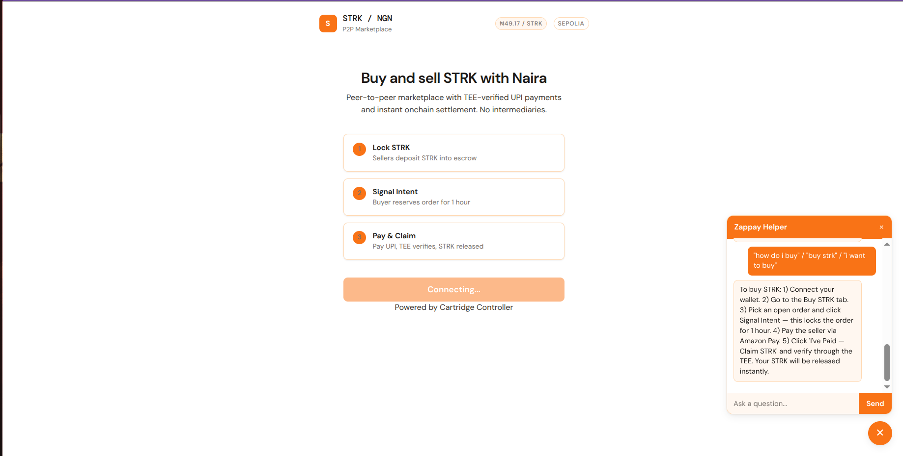

# Zappay



P2P Naira ↔ STRK Marketplace. Send ₦ via any Nigerian bank — receive STRK instantly on-chain.

---

## TL;DR

- **Seller** locks STRK in an on-chain escrow with their bank account number and NGN price.
- **Buyer** sends Naira via any Nigerian bank (Opay, PalmPay, Kuda, Moniepoint, GTBank, etc.).
- The **Eigen TEE** calls the Paystack API to verify the transfer and signs the receipt.
- The signed proof is submitted **on-chain**, validated against the escrow, and **STRK is released to the buyer**.

---

## Architecture

```
┌─────────────┐   deposit STRK + account no.   ┌──────────────────┐
│   Seller    │ ──────────────────────────────► │  Starknet        │
│             │                                  │  Escrow Contract │
└─────────────┘                                  └────────┬─────────┘
                                                         │
┌─────────────┐   Naira bank transfer (off-chain)        │
│   Buyer     │ ──────────────────────────►              │
│             │   Opay / PalmPay / Kuda /                │
│             │   Moniepoint / GTBank / etc.             │
└──────┬──────┘                                          │
       │  claim_funds(signature, receipt)                │
       └─────────────────────────────────────────────────┘
                              │
                              ▼
                    ┌──────────────────┐
                    │  Eigen TEE       │
                    │  - Paystack API  │
                    │  - Verifies txn  │
                    │  - Signs receipt │
                    └──────────────────┘
```

---

## Flow

1. **Deposit** – Seller locks STRK, sets their bank account number and price per STRK in NGN.
2. **Signal Intent** – Buyer signals intent to buy (1-hour lock).
3. **Pay** – Buyer sends Naira to seller's account via any Nigerian bank.
4. **Verify & Sign** – Buyer pastes the Paystack transaction reference. TEE calls Paystack API, confirms the transfer, and signs the receipt.
5. **Claim** – Buyer submits the signed proof on-chain; contract validates and releases STRK.

---

## Supported Banks

Any Nigerian bank that processes transfers through Paystack:

- Opay
- PalmPay
- Kuda
- Moniepoint
- GTBank
- Access Bank
- Zenith Bank
- First Bank
- UBA
- And all other NIBSS-connected banks

---

## Deployments

### Sepolia (Testnet)

| Resource | URL |
|----------|-----|
| **Contract (Starkscan)** | [0x045f0dda5b49e8c994aceeb74f08dcbd47da88cd1ab2085221e76e3f78466c45](https://sepolia.starkscan.co/contract/0x045f0dda5b49e8c994aceeb74f08dcbd47da88cd1ab2085221e76e3f78466c45) |
| **Deploy Transaction** | [0x034cb779c35ce0fd2b2fe315ecd793230179cf69e262d1752720eb303b1a09bd](https://sepolia.starkscan.co/tx/0x034cb779c35ce0fd2b2fe315ecd793230179cf69e262d1752720eb303b1a09bd) |
| **Class Hash** | [0x6ff5c9ddc6a50950771f4b0c666ef2487b9452a1f9f41e4d0a23d56cfb2f5b3](https://sepolia.starkscan.co/class/0x06ff5c9ddc6a50950771f4b0c666ef2487b9452a1f9f41e4d0a23d56cfb2f5b3) |
| **Declare Transaction** | [0x3355507bce26aa13bfc1e7286651c4b49933e543643743be9c0960fe0b79099](https://sepolia.starkscan.co/tx/0x03355507bce26aa13bfc1e7286651c4b49933e543643743be9c0960fe0b79099) |

**Constructor args:**
- `signer_public_key`: `0xd84917d613a8307d167e409503d85bef759f26bbf92cd87e1c994731a104c5`
- `token_address` (Sepolia STRK): `0x04718f5a0fc34cc1af16a1cdee98ffb20c31f5cd61d6ab07201858f4287c938d`

---

## Repo Structure

```
Zappay/
├── src/           # Cairo smart contracts (Starknet)
├── eigentee/      # Eigen TEE service (Paystack API + Express)
├── frontend/      # React + StarkZap frontend
└── README.md
```

---

## Quick Start

### 1. Smart contracts (Cairo)

```bash
scarb build
scarb test
```

> `src/lib.cairo` declares the escrow module and is required as the Scarb crate root.

### 2. Eigen TEE service

```bash
cd eigentee
npm install
cp .env.example .env   # Set MNEMONIC and PAYSTACK_SECRET_KEY
npm run build && npm start
```

Get your Paystack secret key from [dashboard.paystack.com](https://dashboard.paystack.com/#/settings/developers).

### 3. Frontend

```bash
cd frontend
npm install
cp .env.example .env   # Set VITE_ESCROW_ADDRESS, VITE_TEE_SERVER
npm run dev
```

Production build:

```bash
cd frontend
npm run build
```

---

## Tech Stack

- **Smart contracts** – Cairo on Starknet (Sepolia testnet)
- **Wallet** – Cartridge Controller via StarkZap SDK (`starkzap`)
- **TEE** – Eigen TEE with Paystack API for Nigerian bank transfer verification
- **Frontend** – React + Vite, white/orange UI theme

---

## Currency

Denominated in **NGN (Nigerian Naira ₦)**. Live STRK/NGN rates fetched from CoinGecko every 60 seconds.

---

## Security

- **TEE attestation** – The Eigen TEE is attested; the signing key never leaves the enclave.
- **Nullifiers** – Each transaction reference can only be used once on-chain.
- **Intent expiry** – Buyer has 1 hour to complete payment and claim after signaling intent.

---

## In-App Help Bot

Zappay includes a built-in helper bot (the `?` button at the bottom-right). Supported topics:

| Topic | Example phrases |
|-------|----------------|
| About the app | "what is zappay", "how does this work", "explain" |
| Buying STRK | "how do i buy", "buy strk", "i want to buy" |
| Selling STRK | "how do i sell", "sell strk", "create order" |
| Signal Intent | "signal intent", "what is intent", "reserve order" |
| TEE verification | "what is tee", "how is payment verified", "verification" |
| Withdrawing | "withdraw", "get my strk back", "cancel sell order" |
| Wallet | "connect wallet", "cartridge", "how to connect" |
| Cancel intent | "cancel intent", "change my mind", "undo intent" |
| Price / rate | "price", "rate", "naira", "strk price", "ngn" |
| Safety | "safe", "secure", "scam", "can i get scammed" |
| Testnet | "sepolia", "testnet", "test", "real money" |
| Faucet | "faucet", "get strk", "free strk", "test strk" |
| Trade history | "history", "past orders", "settled", "completed" |
| Transfers | "transfer", "send strk", "send to friend" |

---

## License

MIT
